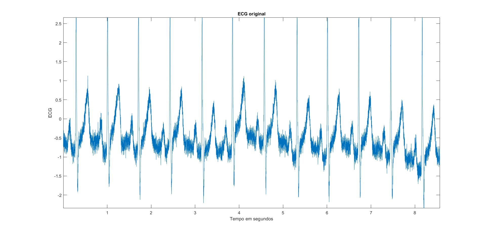
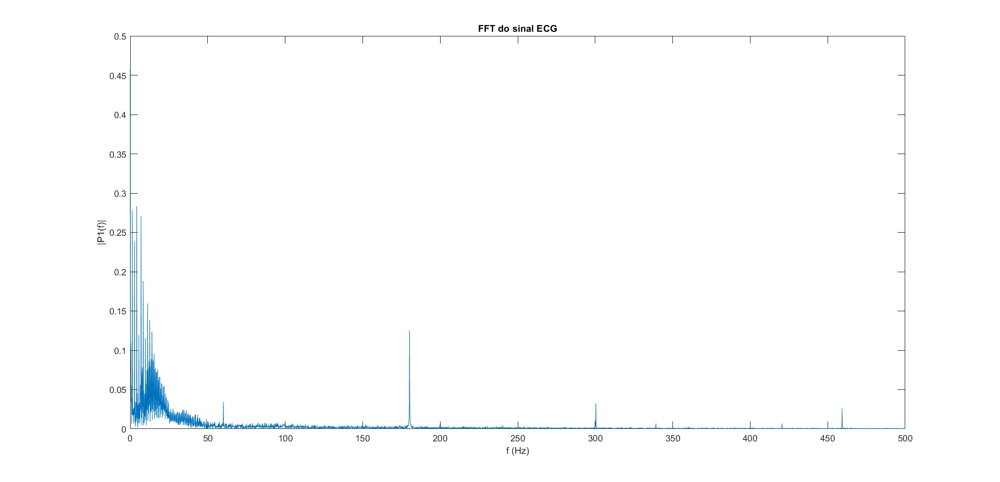
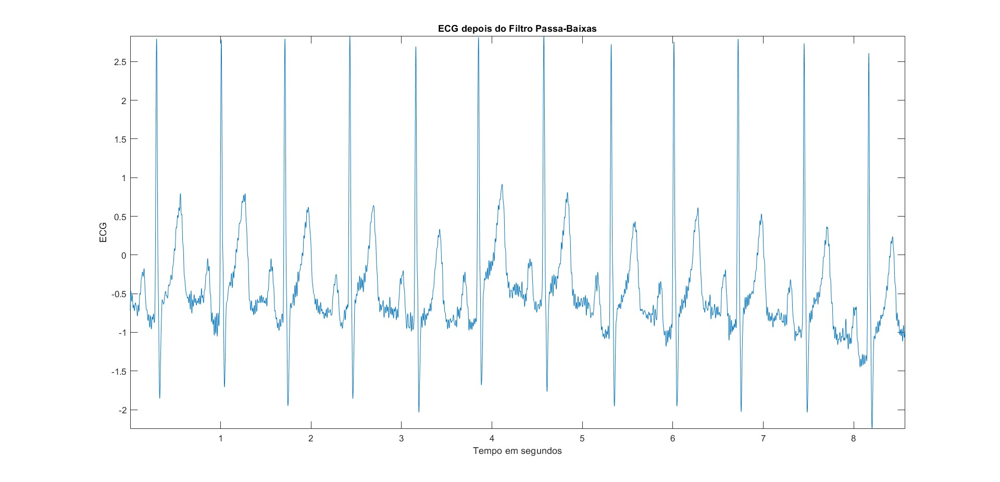
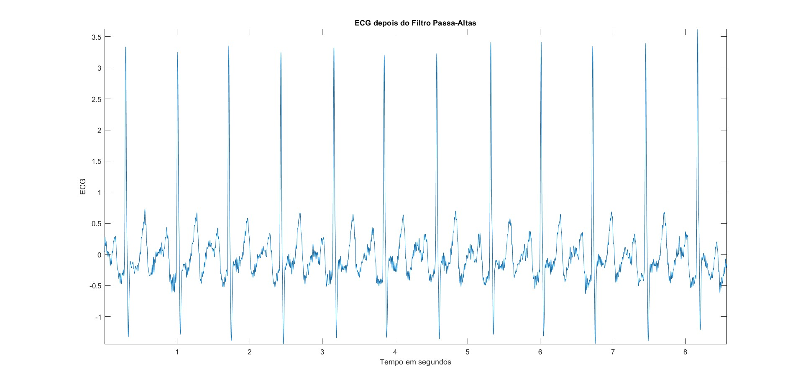
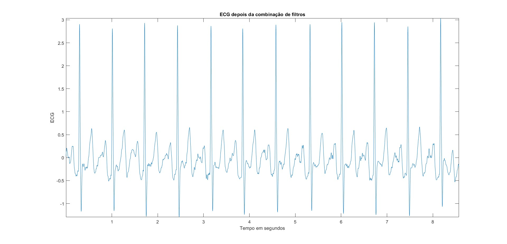

# Removal-of-ECG-artifacts

* Federal University of Campina Grande

* Hortência Diniz Dultra e Silva - 17/11/23


* Remoção de Artefatos do ECG - Projeto Final - PDS


* Livro-Texto: Biomedical Signal Processing, Rangaraj. Wiley

* 3.12 Application: Removal of Artifacts in the ECG

No contexto de um eletrocardiograma (ECG), artefatos referem-se a interferências indesejadas ou sinais anômalos que aparecem nos traçados do ECG e que não representam a atividade elétrica do coração. Esses artefatos podem ser causados por vários fatores externos que interferem com a aquisição adequada dos sinais cardíacos.
Os artefatos podem ser causados por fatores como:

* Movimentos Musculares: contrações musculares, especialmente aquelas causadas pelo tremor ou movimento do paciente durante a gravação do ECG, podem criar artefatos.

* Má Contato dos Eletrodos: se os eletrodos não estiverem devidamente fixados à pele do paciente ou se houver má condutividade elétrica entre o eletrodo e a pele, isso pode resultar em artefatos.

* *Interferência Elétrica:* ruídos elétricos provenientes de fontes externas, como lâmpadas fluorescentes, dispositivos eletrônicos próximos ou cabos elétricos, podem causar interferências nos sinais do ECG.

* Má Qualidade do Equipamento: Equipamentos defeituosos ou mal calibrados podem introduzir artefatos nos traçados do ECG.

* Movimentos do Paciente: Se o paciente se mover durante a gravação do ECG, isso pode causar artefatos nos resultados.

* Interferência Eletromagnética: Equipamentos médicos ou dispositivos eletrônicos presentes nas proximidades do local onde o ECG está sendo realizado podem gerar interferências eletromagnéticas.

Este projeto visa retirar os artefatos de um ECG e nele, temos que tirar os artefatos gerados pela linha elétrica da rede.

No Brasil: f=60Hz

O sinal ECG foi pego de uma base de dados disponibilizada no PVAE.

* O código do sinal ECG está representado pelo seguinte código feito em MatLab

```
clc
clear all  %clears all active variables
close all 

ecg = load('ecg_hfn.dat');
fs = 1000; %frequência de amostragem em Hz
T = 1/fs;

slen = length(ecg);
t=[1:slen]/fs;

```

```
figure;
plot(t, ecg);
axis tight;
title("ECG original");
xlabel('Tempo em segundos');
ylabel('ECG');
```




* Decidi elaborar esse trecho de código para plotar a FFT do ECG para vermos as frequências, no espectro, que vamos remover.
* As frequências da linha da rede elétrica são as que nós devemos observar, dada por 60Hz (a fundamental) e as suas harmônicas (3x60Hz, 5x60Hz, 7x60Hz)
```
ecg_fft = fft(ecg);

P2 = abs(ecg_fft/slen);
P1 = P2(1:slen/2+1);
P1(2:end-1) = 2*P1(2:end-1);
f = fs*(0:(slen/2))/slen;

figure;
plot(f,P1);
title("FFT do sinal ECG");
xlabel("f (Hz)")
ylabel("|P1(f)|")
```




```
[ecg_lowpass, ecg_highpass, ecg_comb] = apply_filters(ecg, fs);

figure;
plot(t, ecg_lowpass);
axis tight;
title("ECG depois do Filtro Passa-Baixas");
xlabel('Tempo em segundos');
ylabel('ECG');

figure;
plot(t, ecg_highpass);
axis tight;
title("ECG depois do Filtro Passa-Altas");
xlabel('Tempo em segundos');
ylabel('ECG');

figure;
plot(t, ecg_comb);
axis tight;
title("ECG depois da combinação de filtros");
xlabel('Tempo em segundos');
ylabel('ECG');
```


* Código projetado para filtro que remove artefatos no ECG


```
function [ecg_lowpass, ecg_highpass, ecg_comb] = apply_filters(ecg, fs)

    order = 8;
    nyquist = 0.5 * fs; %Frequência de Nyquist é a metade da taxa de amostragem do sinal
```

```
    % Apply Butterworth lowpass filter
    lowcut = 70.0;  % Frequência de corte em Hz
    low = lowcut / nyquist; %Calcula a frequência normalizada
    [n, d] = butter(order, low, 'low');
    ecg_lowpass = filtfilt(n, d, ecg); %Aplica o filtro ao sinal ECG usando filtfilt para evitar distorções de fase.
```




```
    % Apply Butterworth highpass filter
    highcut = 3.0;  % Frequência de corte em Hz
    high = highcut / nyquist; % Adjusted the variable name here
    [n, d] = butter(order, high, 'high');
    ecg_highpass = filtfilt(n, d, ecg_lowpass);
```




```
    % Parâmetros Fornecidos pelo Livro-Texto para realizar o projeto do Filtro Combinado
    n = [0.6310, -0.2149, 0.1512, -0.1288, 0.1227, -0.1288, 0.1512, -0.2149, 0.6310];
    d = 1;

    ecg_comb = filter(n, d, ecg_highpass);
end
```



* Conclui-se que é perceptível quando comparamos os sinais filtrados com o original que os ruídos foram retirados. Portanto, o filtro elaborado é eficiente. 
